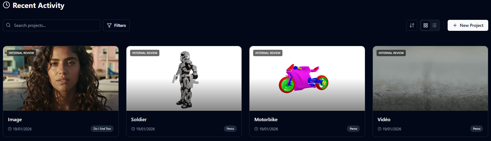
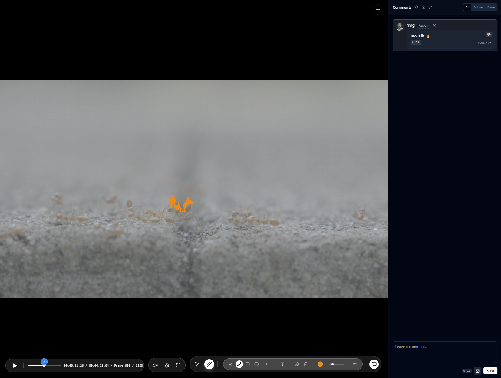
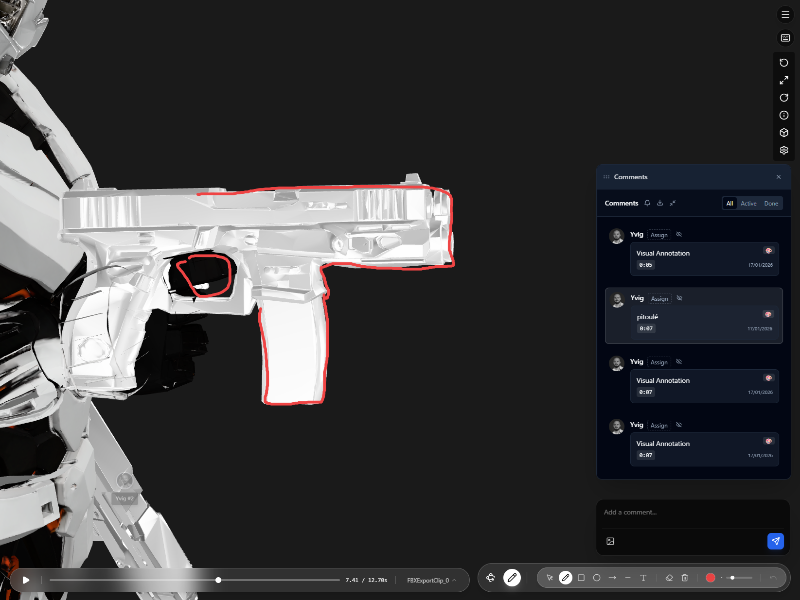
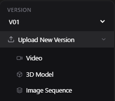

<p align="center">
  
</p>

<p align="center">
  <b>The Ultimate Video & Creative Review Tool</b><br>
  Open-source, self-hostable, and precise.<br>
  v1.1.0 - The Global Update 🌍<br>
  <a href="https://discord.gg/vw7h6BqcNc">
    
  </a>
  <br>
  <a href="./README_FR.md">🇫🇷 Version Française</a>
</p>

---

**ReView** enables creators, studios, and developers to streamline feedback cycles. Collaboratively review Videos, Images, and **3D Models** with frame-accurate precision.

## 🚀 What's New in v1.1.0

The **Global Update** brings internationalization and massive 3D improvements!

- **🌍 Multilingual Support**: Interface and documentation now available in English and French.
- **🧊 Advanced 3D Review**: Surface-anchored hotspots, native FBX conversion, and GIF turnarounds.
- **🎨 UI & UX Overhaul**: Redesigned guide and polished interface.
- **📩 Smarter Communications**: Improved notifications and email digests.



## ✨ Features

### 🖊️ Precision Annotation
Draw on frames with vector tools (Pen, Arrow, Shapes). Comments are tied to the exact frame (video) or position (image/3D).



### 🧊 3D & Animation
Inspect GLB/FBX models with 360° view. Place **hotspots directly on the 3D surface**. Support for textures and animation playback.

<p align="center">
  
</p>

### 🔄 Versioning & Comparison
Track history of videos and models. Compare versions side-by-side to see progress instantly.



### 👥 Teams & Collaboration
- **Real-time discussions**: Threaded comments and mentions (@User).
- **Team Management**: Custom roles (Admin, Member, Client).
- **Client Review**: Secure, invite-only links for external guests.

## 🚀 Getting Started

Quickly deploy ReView using Docker (Recommended) or Node.js.

```bash
# Clone the repository
git clone https://github.com/YvigUnderscore/review-app.git

# Install dependencies (Backend)
cd review/backend
npm install

# Install dependencies (Frontend)
cd ../frontend
npm install
```

See the [Installation Guide](./installation.md) for full deployment instructions.

## 🛠 Tech Stack

Built with modern, robust technologies:
- **Frontend**: React, Vite, TailwindCSS, Framer Motion
- **Backend**: Node.js, Express, Socket.IO, Prisma
- **Media**: FFmpeg, Google <model-viewer>

## 🙏 Acknowledgments & Licenses

ReView wouldn't be possible without these incredible open-source projects. A huge thank you to their creators and contributors!

### Core & Frameworks
- **[React](https://react.dev/)** (MIT) - The library for web and native user interfaces.
- **[Vite](https://vitejs.dev/)** (MIT) - Next Generation Frontend Tooling.
- **[Node.js](https://nodejs.org/)** (MIT) - JavaScript runtime built on Chrome's V8 engine.
- **[Express](https://expressjs.com/)** (MIT) - Fast, unopinionated, minimalist web framework for Node.js.
- **[Prisma](https://www.prisma.io/)** (Apache-2.0) - Next-generation Node.js and TypeScript ORM.

### UI & Experience
- **[TailwindCSS](https://tailwindcss.com/)** (MIT) - Rapidly build modern websites without ever leaving your HTML.
- **[Framer Motion](https://www.framer.com/motion/)** (MIT) - A production-ready motion library for React.
- **[Lucide React](https://lucide.dev/)** (ISC) - Beautiful & consistent icon toolkit.
- **[Sonner](https://sonner.emilkowal.ski/)** (MIT) - An opinionated toast component for React.
- **[React Markdown](https://github.com/remarkjs/react-markdown)** (MIT) - Markdown component for React.

### Media & 3D
- **[FFmpeg](https://ffmpeg.org/)** (LGPL/GPL) - The leading multimedia framework.
- **[Google <model-viewer>](https://modelviewer.dev/)** (Apache-2.0) - Easily display interactive 3D models on the web.
- **[Three.js](https://threejs.org/)** (MIT) - JavaScript 3D library.
- **[PDFKit](https://pdfkit.org/)** (MIT) - A JavaScript PDF generation library for Node and the browser.

### Backend & Utilities
- **[Socket.IO](https://socket.io/)** (MIT) - Bidirectional and low-latency event-based communication.
- **[Multer](https://github.com/expressjs/multer)** (MIT) - Middleware for handling `multipart/form-data`.
- **[Bcrypt.js](https://github.com/dcodeIO/bcrypt.js)** (MIT) - Optimized bcrypt in JavaScript with zero dependencies.
- **[JsonWebToken](https://github.com/auth0/node-jsonwebtoken)** (MIT) - JSON Web Token implementation.
- **[Node-cron](https://github.com/node-cron/node-cron)** (ISC) - Task scheduler in pure JavaScript for Node.js.
- **[Nodemailer](https://nodemailer.com/)** (MIT) - Send emails from Node.js – easy as cake!
- **[Helmet](https://helmetjs.github.io/)** (MIT) - Help secure Express apps with various HTTP headers.
- **[Cors](https://github.com/expressjs/cors)** (MIT) - Middleware for enabling CORS.
- **[Axios](https://axios-http.com/)** (MIT) - Promise based HTTP client for the browser and node.js.
- **[Adm-zip](https://github.com/cthackers/adm-zip)** (MIT) - A Javascript implementation of zip for nodejs.
- **[CSV-Writer](https://github.com/ryu1kn/csv-writer)** (MIT) - Convert objects/arrays into a CSV string or write to a file.
- **[Puppeteer](https://pptr.dev/)** (Apache-2.0) - Headless Chrome Node.js API.

## 📄 License

This project is licensed under the MIT License.
